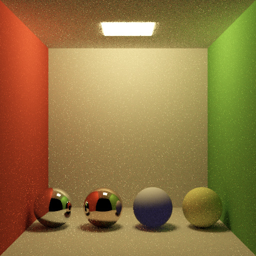
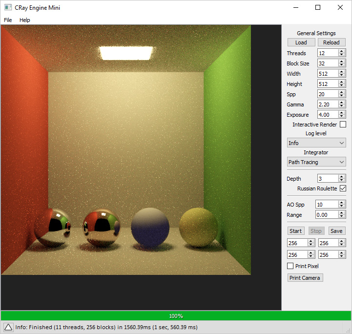

# Building or Generating VS Solution of additional utilities
Even though the engine files can be used directly in your code, three accompanied tools are also provided that the engine is integrated at. These tools are:

* Console example: Just a command line renderer written that uses the C interface to render scenes. Scene files are loaded through a simple XML format.
* Tests: A separate executable allowing to run some tests to test the code validity
* QT Gui: A Qt interface for quick view and navigation using interactive rendering

These utilities have associated dependencies:
* [TinyXML2](https://github.com/leethomason/tinyxml2) for the scene loader
* [stb_image](https://github.com/nothings/stb), for image I/O
* [tinyobjloader](https://github.com/tinyobjloader/tinyobjloader) and [tinyply](https://github.com/ddiakopoulos/tinyply), for *.OBJ* and *.PLY* model parsing
* [Qt](https://www.qt.io/), for the GUI interface

All these, apart from Qt, are also included in the [3rdParty](3rdParty/include) folder. Finally, [ImageMagick](https://imagemagick.org) is used to generate the executables' icons.

The renderer successfuly compiles on Windows, Linux and MacOS, using MSVC, GCC and Clang.
It has been tested on MSVC 14.1+ (Visual Studio 2017+), GCC 5+ and Clang 3.9+. By default, only the *Console Example* is built. The steps to generate a makefile or a Visual Studio solution are:
```shell
mkdir build
cd build
# Windows (VS 2019)
cmake -G "Visual Studio 16 2019" ..
# Windows (MinGW)
cmake -G "MinGW Makefiles" -DCMAKE_SH="CMAKE_SH-NOTFOUND" ..
# GCC
cmake -G "Unix Makefiles" ..
# Clang
cmake -G "Unix Makefiles" -DCMAKE_CXX_COMPILER="/usr/bin/clang++" -DCMAKE_C_COMPILER="/usr/bin/clang" ..
```

Additional options:
* To force 32-bit compilation use *-A Win32* for Visual Studio and *CXXFLAGS=-m32 CFLAGS=-m32* for the other platforms.
* To build the Qt GUI use *-DQT_ENABLE=ON*. If Qt has not been installed on a system path, add the (dependent) option:
<br/> *-DQT_CUSTOM_PATH=\<Qt_absolute_path>*.
* To build the tests, add *-DTESTS_ENABLE=ON*. The tests can be executed by going to the *build* folder and running:
```shell
ctest -C Release
```
Any failed tests will save the output images at the [data/tests/images](data/tests/images) folder.
* To regenerate the test images (in case there are new features or important code changes), add the (dependent) option *TESTS_GENERATE*, e.g. *-DTESTS_ENABLE=ON -DTESTS_GENERATE=ON*.

To compile, go to the *build* folder and run:
```shell
# Release build
cmake --build . --config Release
# Debug build
cmake --build . --config Debug
```

## Command-line Tool Example
Running the command line tool prints the following:
```shell
C:\crayengine_mini\bin\buildx64WindowsMSVCRelease\CRay_mini_console_examplex64.exe
List of available commands:
 --scene        # full path of the scene to load. (Default: None -> MUST BE PROVIDED).
 --output       # filename to save. (Default: <current directory>/result.hdr). Supported formats: bmp/png/jpg/hdr
 --help         # displays this message
```

Running a scene file, e.g. the cornell box:
```shell
C:\crayengine_mini\bin\buildx64WindowsMSVCRelease\CRay_mini_console_examplex64.exe --scene cornell.scene
Info: Loaded scene file: cornell.scene
Info: Starting rendering
Info: Preprocessing scene
Info: Preprocessing scene took: 2.24ms
[==================================================================================================>] 100.00%
Info: Renderer stats:
Info:     Threads:                    12 (with main thread)
Info:     Tile Size:                  32
Info: Scene stats:
Info:     Cameras:                    1
Info:     Lights (unique):            1
Info:     Total Light sources:        1
Info:     Materials:                  8
Info:     Textures (size):            0 (0b)
Info: Integrator stats:
Info:     Samples per pixel (spp):    20
Info:     Type:                       Path Tracing
Info:     Max depth:                  3 (2.40 per spp)
Info:     Russian roulette:           yes
Info: BVH Build Stats:
Info:     Primitives:                 10
Info:     Total nodes:                7
Info:     Leaf nodes:                 3
Info:     Children nodes:             4 (2.50 per node)
Info:     Max depth:                  2
Info:     Node size:                  128b
Info:     Total nodes size:           896b
Info:     Total primitives size:      8.84KB
Info: BVH Tracing Stats:
Info:     Rays:                       17599701 (3.36 per spp)
Info:     Shadow rays:                12465174 (2.38 per spp)
Info:     Prim Intersect:             5.65 per ray
Info:     Prim Intersect Shadow:      5.03 per ray
Info:     Node traversals:            5.87 per ray
Info:     Node traversals Shadow:     5.60 per ray
Info: Framebuffer Stats:
Info:     Dimensions:                 512x512
Info:     Pixels:                     262144
Info:     Float Buffer Size:          6.00MB
Info:     RGB Buffer Size:            768.00KB
Info: Finished (12 threads, 256 blocks) in 1460.81ms (1 sec, 460.81 ms)
```

This will generate the following image (converted to 8-bit):


## Qt GUI Tool Example
Alternatively, using the Qt GUI will result in the following:
